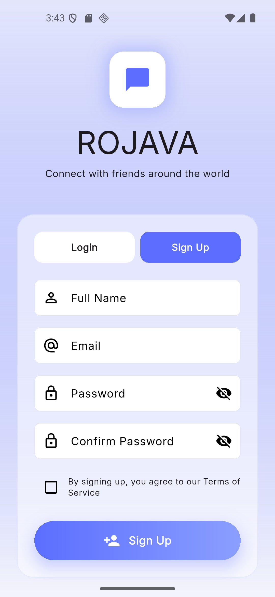
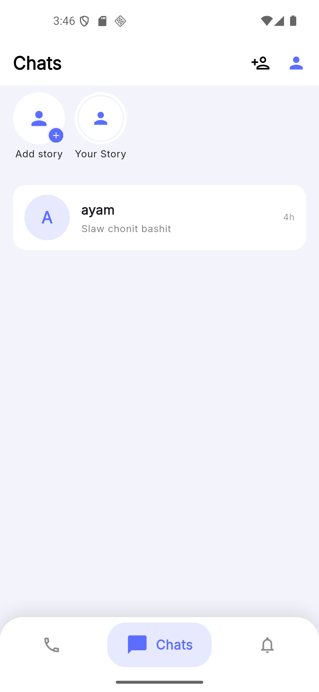
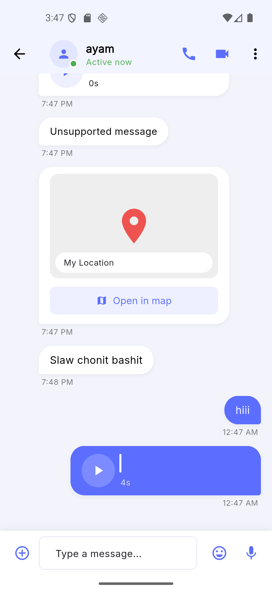
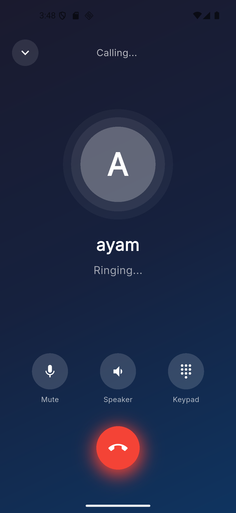
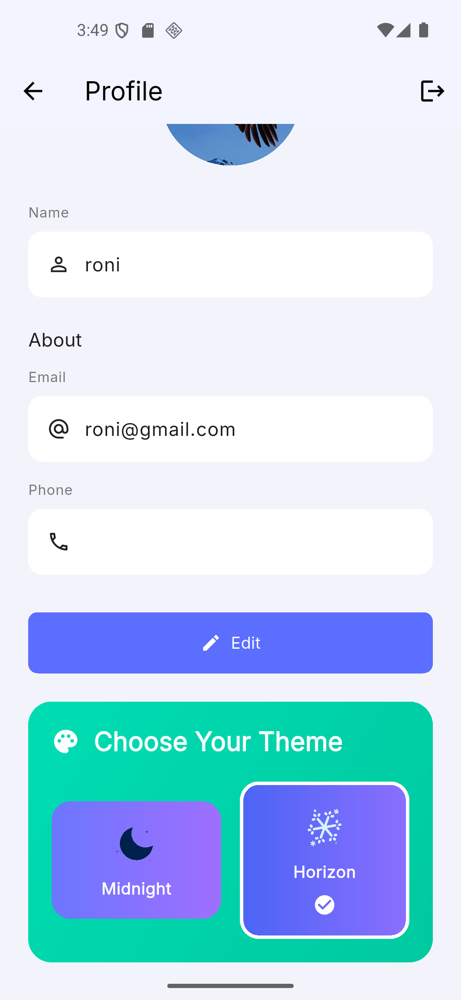
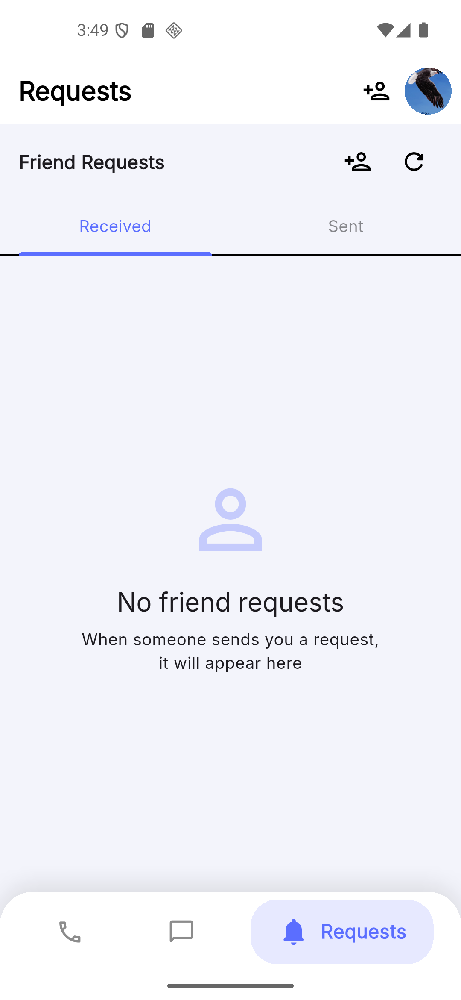

# <div align="center">

# 

# 

# 

# \# ROJAVA

# \### Real-time Social Communication App

# 

# \[!\[Flutter](https://img.shields.io/badge/Flutter-3.x-02569B?style=for-the-badge\&logo=flutter)](https://flutter.dev)

# \[!\[Supabase](https://img.shields.io/badge/Supabase-Backend-3ECF8E?style=for-the-badge\&logo=supabase)](https://supabase.com)

# \[!\[WebRTC](https://img.shields.io/badge/WebRTC-P2P\_Calls-333333?style=for-the-badge)](https://webrtc.org)

# \[!\[Dart](https://img.shields.io/badge/Dart-Language-0175C2?style=for-the-badge\&logo=dart)](https://dart.dev)

# 

# \*\*Connect with friends around the world — chat, call, share stories, and more.\*\*

# 

# </div>

# 

# \---

# 

# \## ✨ Features

# 

# | Feature | Description |

# |---|---|

# | 💬 \*\*Real-time Chat\*\* | Text, images, voice notes, and location sharing |

# | 📍 \*\*Live Location\*\* | Share your live location for 15 minutes |

# | 📞 \*\*Voice \& Video Calls\*\* | P2P calls powered by WebRTC |

# | 📖 \*\*Stories\*\* | 24-hour disappearing stories (friends only) |

# | 🤖 \*\*AI Assistant\*\* | Built-in AI for instant help and conversation |

# | 👥 \*\*Friends System\*\* | Send/accept friend requests, search users |

# | 🎨 \*\*Dual Themes\*\* | Midnight (dark) and Horizon (light) themes |

# | 🛡️ \*\*Ban System\*\* | Device fingerprinting with SHA-256 |

# 

# \---

# 

# \## 📱 Screenshots

# 

# <div align="center">

# 

# | Auth | Home | Chat |

# |---|---|---|

# |  |  |  |

# 

# | Voice Call | Stories | Profile |

# |---|---|---|

# |  |  |  |

# 

# | Calls History | Requests | Add Friends |

# |---|---|---|

# |  |  |  |

# 

# </div>

# 

# \---

# 

# \## 🛠️ Tech Stack

# 

# \- \*\*Frontend:\*\* Flutter (Dart)

# \- \*\*Backend:\*\* Supabase (PostgreSQL + Realtime + Storage)

# \- \*\*Calls:\*\* WebRTC (P2P) + TURN Servers

# \- \*\*State Management:\*\* Riverpod

# \- \*\*AI:\*\* Integrated AI Assistant

# 

# \---

# 

# \## 🚀 Getting Started

# 

# \### Prerequisites

# \- Flutter SDK

# \- Supabase account

# 

# \### Installation

# 

# 1\. Clone the repo

# ```bash

# git clone https://github.com/roni-dolamari/rojava-social-app.git

# ```

# 

# 2\. Install dependencies

# ```bash

# flutter pub get

# ```

# 

# 3\. Create `lib/core/config/supabase\_config.dart`

# ```dart

# class SupabaseConfig {

# &#x20; static const String url = 'YOUR\_SUPABASE\_URL';

# &#x20; static const String anonKey = 'YOUR\_SUPABASE\_ANON\_KEY';

# }

# ```

# 

# 4\. Run the app

# ```bash

# flutter run

# ```

# 

# \---

# 

# \## 📄 License

# 

# This project is licensed under the MIT License.

# 

# \---

# 

# <div align="center">

# Made with ❤️ by <a href="https://github.com/roni-dolamari">roni-dolamari</a>

# </div>

